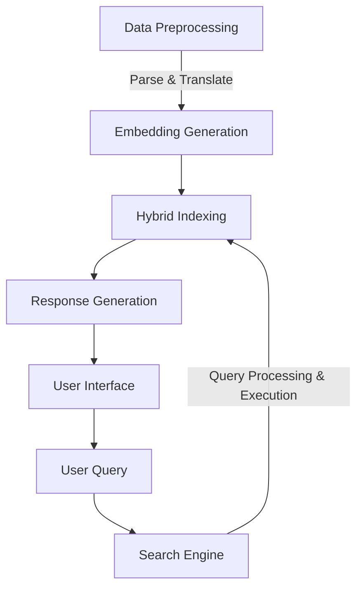
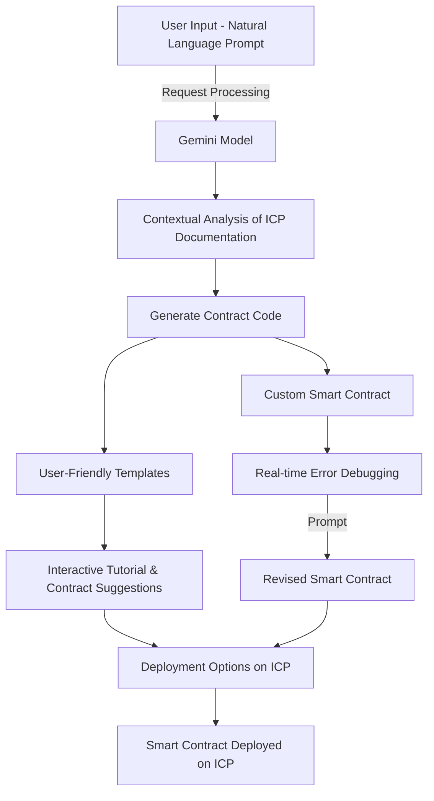
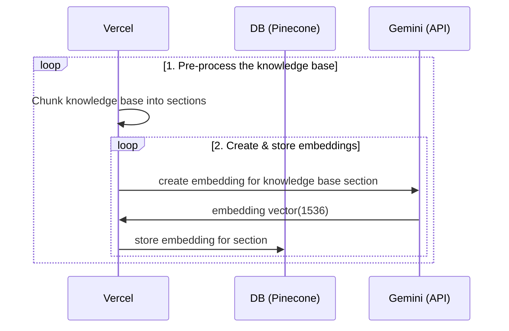
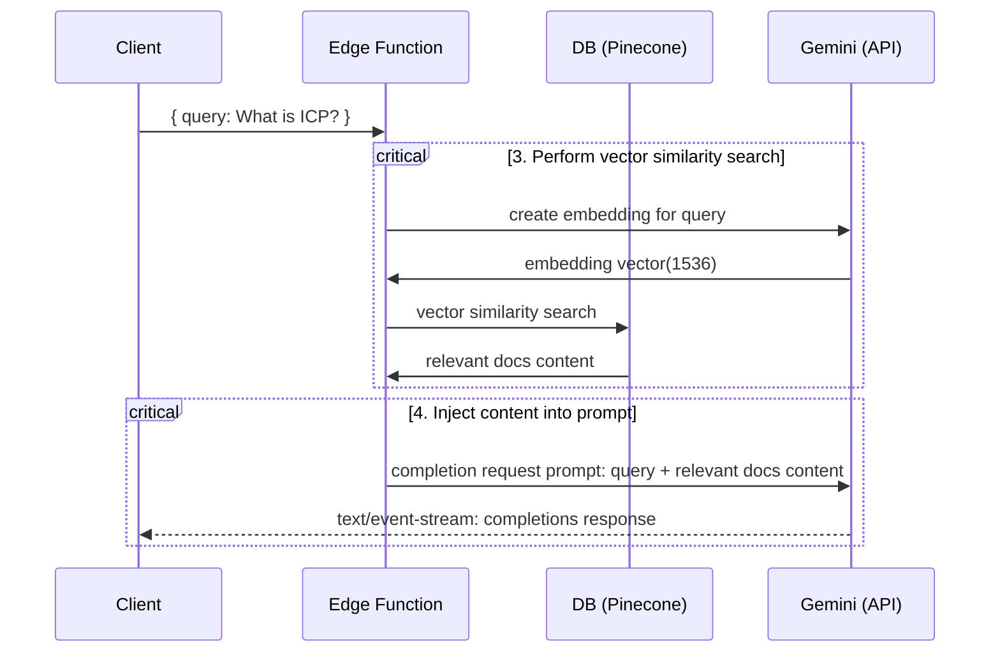

<h1 align="center">ICPGPT Chatbot</h1>

  Write and deploy smart contract on ICP using natural language prompts.

ICPGPT is a powerful tool that leverages the capabilities of Gemini model to provide users with contextually relevant answers from the ICP documentation. It serves as a bridge between user queries and the vast knowledge base of ICP.

## User Flow

## Sequential Diagram

## Runtime
